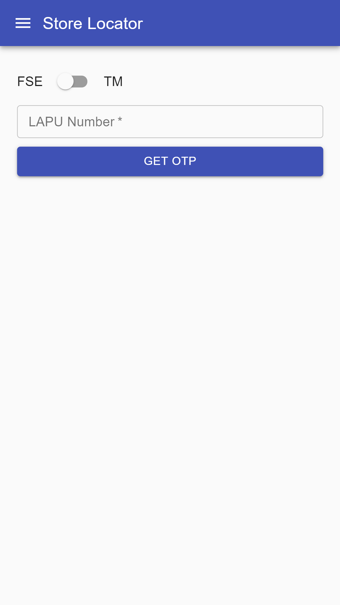
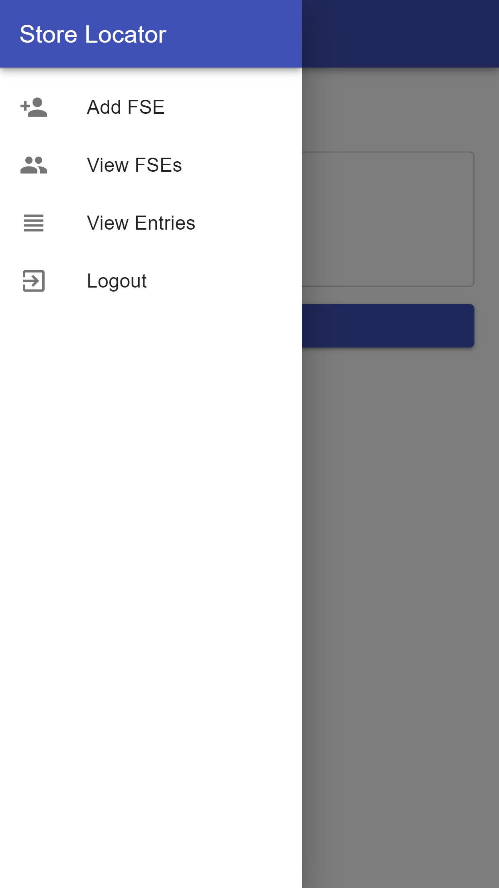
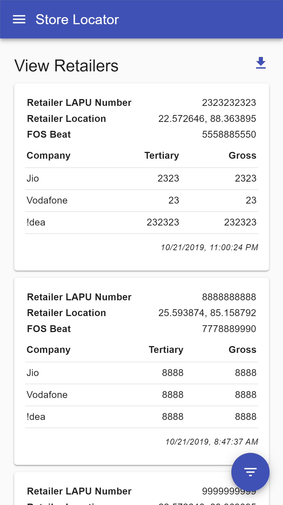
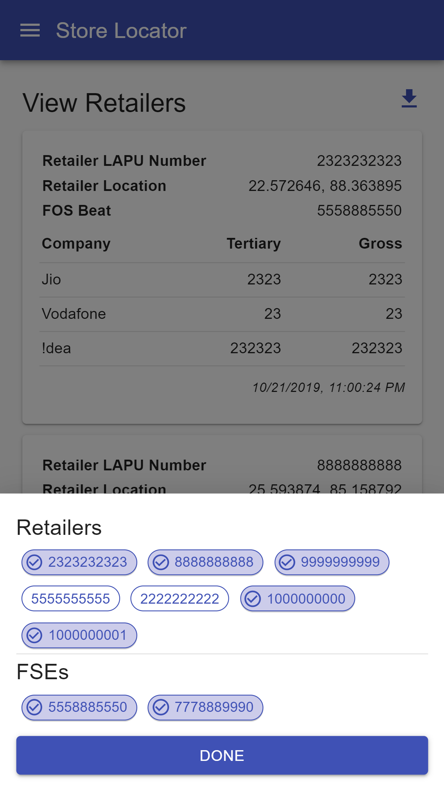
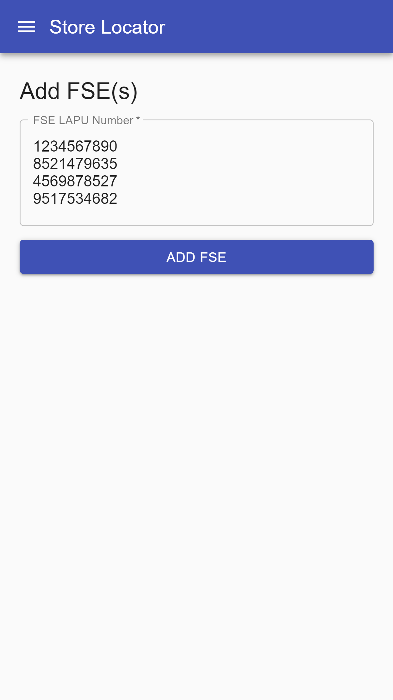

# Store Locator

This app was developed for a friend working in a telecom company who needed to record few details of the stores he/his subordinates visits.

This web app is developed using React and Redux. Google's Firebase is used for authentication and Firestore for the No Sql database. For the styling, many React components from material-ui.com has been used. This is built ideally for a mobile phone or a tablet as per the requirements, however, it can be used on desktop as well.

## Functionalities
- Phone Number Authentication using Firebase Authentication
- Role Based Access Control
    - Field Service Engineers (FSEs) can just add store details and view their own entries.
    - Territory Managers (TMs) can view all the details of FSEs under them, update/delete them and download the entries in an excel workbook.
- Add Store Details including the location of the store (GeoLocation API)
- TM can add FSEs (one or multiple at a time, can be copy pasted from excel, notepad, etc.), only these FSEs can login
- Filter based on FSE and Store
- Download Excel Report

## Libraries Used
- react
- react-dom
- redux
- react-redux
- redux-thunk
- firebase
- @material-ui/core
- @material-ui/icons
- react-export-excel

## Images
  
  
  
  
  